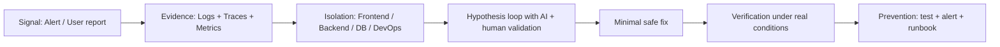
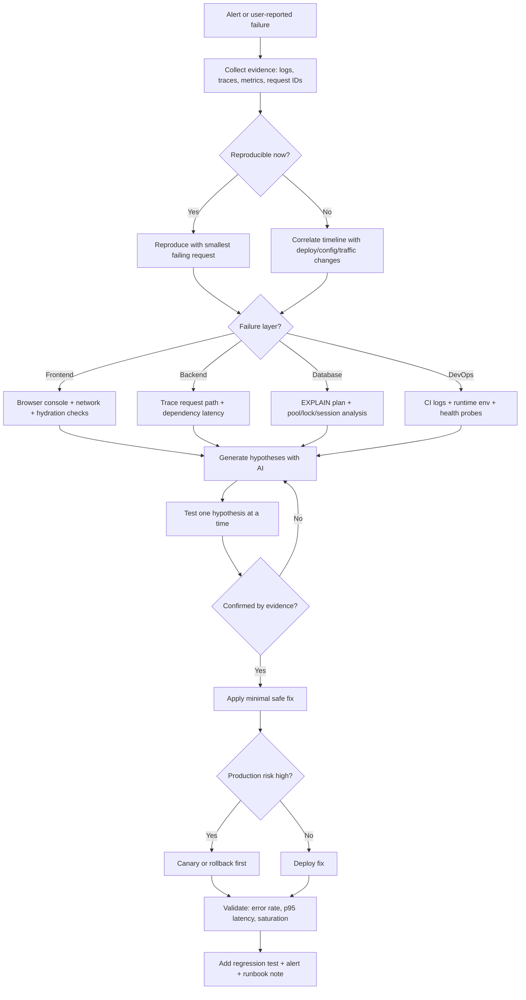

# 🚀 AI-Powered Debugging Handbook

**The missing playbook for debugging real systems under pressure.**

[](prompts/README.md)
[](prompts/README.md)
[](tools/README.md)
[](tools/README.md)
[](case-studies/database-pool-exhaustion.md)
[](case-studies/deployment-crashloop-env-drift.md)

⚠️ Production incident at 2:13 AM. Alerts flooding. Logs noisy. Root cause unclear.

Most developers do not fail at coding.  
They fail at debugging under pressure.

This handbook gives you a **repeatable system** to fix real production issues fast with structured debugging and AI support.

> A practical debugging guide for frontend bugs, backend issues, database failures, and deployment incidents. Built to help you fix errors fast when the logs are noisy, the symptoms are misleading, and time is limited.

If your system only works when the bug is obvious, it is not production-ready.

This handbook is built for real debugging pressure: vague stack traces, partial outages, intermittent failures, performance regressions, and incidents that only reproduce in one environment.

## ❗ Why This Exists

Most debugging guides are written for clean demos, not messy production incidents.

In real systems, you get:

- vague errors that hide the real root cause
- incomplete logs and conflicting symptoms
- pressure to ship a fix before users feel the impact
- incidents that only break in one environment

This handbook exists to turn those moments into a **clear workflow** you can execute.

## 👥 Who This Is For

- Engineers handling real production debugging, not toy examples
- Backend developers dealing with latency, retries, and dependency failures
- Frontend developers chasing browser-only and hydration bugs
- DevOps/SRE teams handling deploy regressions and runtime incidents
- Team leads building repeatable incident response workflows

**Quick Navigation**

- [Frontend issues](#-frontend-issues)
- [Backend issues](#-backend-issues)
- [Database issues](#-database-issues)
- [DevOps / Deployment issues](#-devops--deployment-issues)
- [AI debugging](#-ai-powered-debugging)

**Precision Jump Navigation (No Long Scrolling)**

| Need | Jump Directly |
|------|---------------|
| Start debugging now | [Start Here](#-start-here-if-youre-debugging-right-now) |
| See the full flow first | [Debugging Flow](#-debugging-flow) |
| View a real incident sample | [Real Debugging Snapshot](#-real-debugging-snapshot) |
| Frontend bugs | [Frontend Issues](#-frontend-issues) |
| Backend issues | [Backend Issues](#-backend-issues) |
| Database issues | [Database Issues](#-database-issues) |
| DevOps / deployment issues | [DevOps / Deployment Issues](#-devops--deployment-issues) |
| AI workflow and prompts | [AI-Powered Debugging](#-ai-powered-debugging) |
| Common mistakes to avoid | [Common Debugging Mistakes](#-common-debugging-mistakes) |
| Best practices checklist | [Best Debugging Practices](#-best-debugging-practices) |
| Incident triage checklist | [Incident Triage Checklist](#-incident-triage-checklist) |
| References and docs | [References and Resources](#-references-and-resources) |
| Contribution section | [Contribute](#-contribute) |

**By Asset Type**: [Prompts](prompts/README.md) | [Templates](templates/README.md) | [Tools](tools/README.md) | [Case Studies](case-studies/README.md)

## 🧱 Handbook Modules

Think of this repository as a modular debugging product: prompts, templates, tools, and incident patterns that work together.

| Module | Purpose | Open |
|--------|---------|------|
| Prompts Playbook | Fast AI prompts for logs, stack traces, and deploy diffs | [Open](prompts/README.md) |
| Templates Kit | Reusable triage, **root cause**, and post-incident templates | [Open](templates/README.md) |
| Tools Reference | Battle-tested debugging and observability stack | [Open](tools/README.md) |
| Case Studies Hub | Real incident patterns with fixes and verification steps | [Open](case-studies/README.md) |

**Quick Access Docs**

- [Prompts Playbook](prompts/README.md) - copy-paste prompts for logs, stack traces, and release diffs
- [Templates Kit](templates/README.md) - incident triage, root cause, and post-incident templates
- [Tools Reference](tools/README.md) - practical tool stack for debugging and observability
- [Case Studies Hub](case-studies/README.md) - real incident writeups and reusable failure patterns

## ⚡ TL;DR

- Use this as a debugging playbook, not a theory doc.
- Start with logs, metrics, and reproduction before touching code.
- Isolate the layer first: frontend, backend, database, or infrastructure.
- Use AI as a fast analyst and pair debugger, not as an authority.
- Keep a tight loop: observe, hypothesize, test, verify, document.
- Favor **root cause** analysis over symptom patching.

---

## 🧩 Debugging System Overview




---

## 🧭 Debugging Flow



**Reading order:** start at the symptom, move through evidence, and do not jump to code until the failure boundary is clear.

---

## 📸 Real Debugging Snapshot

### Scenario: DB connection pool exhaustion during peak traffic

**Raw error / log snippet**

```text
2026-04-15T09:41:12.884Z ERROR api.checkout POST /checkout failed
error=Timeout acquiring connection from pool after 30000ms
pool.active=50 pool.idle=0 pool.waiting=127
query=SELECT * FROM orders WHERE user_id = $1 ORDER BY created_at DESC LIMIT 20
trace_id=8f3c2a1d6c7b4a2f
```

**Step-by-step fix**

| Step | Action | Why It Helped |
|------|--------|---------------|
| 1 | Confirmed the error happened under traffic, not in local dev | Reproduction scope mattered |
| 2 | Traced the request path from checkout API to DB client | The app was waiting on DB connections, not CPU |
| 3 | Ran `EXPLAIN` on the slow query | The query was scanning too many rows |
| 4 | Found a long transaction holding connections open | Pool exhaustion was a symptom, not the root cause |
| 5 | Added a composite index and reduced transaction scope | Connection wait time dropped immediately |
| 6 | Added a pool-wait alert and a regression test | The failure became visible before full outage |

**Before / after impact**

| Metric | Before | After |
|--------|--------|-------|
| p95 checkout latency | 8.2s | 620ms |
| Error rate | 7.4% | 0.2% |
| Pool wait time | 30s timeouts | < 20ms |
| Incident duration | Ongoing until manual restart | Resolved with root cause fix |

---

## ⚡ Start Here (If You’re Debugging Right Now)

Use this when you need progress in the next 10 minutes.

1. Find the **first error**, not the loudest one.
2. Isolate the failing layer: browser, API, DB, queue, deploy, or infra.
3. **Reproduce** with the smallest failing request or payload.
4. Ask **what changed**: code, config, deploy, dependency, or traffic.
5. Use AI for hypotheses, then verify each one with evidence.

---

## 🧠 Debugging Like a Senior Engineer

- **What changed** is usually more useful than what failed.
- The **first error** matters more than the final crash.
- Config bugs beat code bugs more often than people admit.
- If it only fails in one environment, treat it as an environment mismatch first.
- If latency rises with traffic, suspect concurrency, saturation, or downstream pressure.
- If the fix feels too easy, you probably treated the symptom.
- If AI gives you one answer with too much confidence, ask for alternatives and proof.
- Production debugging is mostly evidence handling, not guesswork.
- The system is telling you where to look if you read the logs in order.
- **Reproduction** is a skill multiplier. Without it, you are patching blind.

## 📌 What This Handbook Covers

| Area | What You Get | Why It Matters |
|------|--------------|-----------------|
| Frontend bugs | Browser errors, UI state issues, hydration problems, CORS, API failures | Most “frontend” bugs are actually integration or state problems |
| Backend issues | 500s, auth failures, timeouts, memory leaks, slow services | Backend bugs usually fail under load or edge cases |
| Database issues | Slow queries, deadlocks, exhausted pools, bad indexes, migration problems | Database problems often look like application bugs |
| DevOps / deployment | CI failures, broken releases, container crashes, DNS, env mismatch | Production incidents often start in deployment, not code |
| AI-era workflow | ChatGPT, Copilot, log analysis, prompt patterns, safe usage | AI can save time if you give it the right evidence |

---

## 📂 Explore More

| Area | What You’ll Find |
|------|------------------|
| [templates/](templates/) | Debugging templates for incident notes, triage, and repeatable investigation |
| [prompts/](prompts/) | AI prompts for logs, stack traces, root cause analysis, and release debugging |
| [case-studies/](case-studies/) | Real-world style failure patterns and incident writeups |
| [tools/](tools/) | Utility references for debugging, observability, and AI-assisted workflows |

One-click documents:

- [Open Prompts README](prompts/README.md)
- [Open Templates README](templates/README.md)
- [Open Tools README](tools/README.md)
- [Open Case Studies README](case-studies/README.md)

---

## 🧭 Debugging Workflow That Actually Works

Use this flow as your incident execution loop, not just documentation.

| Step | What To Do | Output You Want |
|------|------------|-----------------|
| 1. Define the failure | Write down the exact symptom, impact, and scope | A precise problem statement |
| 2. Reproduce it | Trigger the bug in a controlled way | A reliable reproduction path |
| 3. Collect evidence | Logs, traces, metrics, screenshots, request IDs, timestamps | Enough context to avoid guessing |
| 4. Isolate the layer | UI, API, service, DB, queue, cache, infra | The failure boundary |
| 5. Form a hypothesis | One likely root cause at a time | A testable explanation |
| 6. Validate | Change one thing, rerun, compare results | Proof, not vibes |
| 7. Fix root cause | Correct the **root cause**, not the symptom | Stable behavior |
| 8. Prevent recurrence | Add tests, alerts, runbooks, guardrails | Fewer repeats |

### Fast triage checklist

- What changed recently?
- Is the issue reproducible?
- Is it local, one environment, or all environments?
- Is there a request ID, trace ID, or timestamp?
- What is the first failing layer?
- What does the log say before the failure, not after?

**Rule of thumb:** if you cannot point to the **first bad signal**, you do not have a **root cause** yet.

---

## 🧠 Debugging by Category

### 🌐 Frontend Issues

| Problem | Symptoms | Common Mistake ❌ | Correct Approach ✅ | AI Usage 🤖 |
|--------|----------|------------------|-------------------|------------|
| API not working | Empty UI, failed fetch, 404/500 in Network tab | Blaming the backend immediately | Check request URL, headers, auth, response payload, and browser devtools | “Explain this fetch failure and tell me the most likely root cause.” |
| CORS error | Browser blocks request, console says CORS policy | Randomly changing frontend code | Verify server headers, credentials mode, origin, and preflight response | “Analyze this CORS error and tell me what server-side header is missing.” |
| State not updating | UI stays stale after action | Rewriting the component blindly | Check async flow, state mutation, stale closures, cache invalidation | “Find the bug in this React state update flow.” |
| Hydration mismatch | UI renders differently on client/server | Ignoring SSR differences | Compare server-rendered HTML and client state, check non-deterministic rendering | “Explain this hydration mismatch and give likely causes.” |
| Blank page | White screen or nothing renders | Restarting the app without reading the console | Open console, inspect stack trace, isolate failing component tree | “Walk through this frontend stack trace and identify the failing component.” |
| Infinite spinner | Loading never finishes | Adding another loader state | Check promise resolution, abort logic, dependency loops, and API timeout handling | “Review this loading flow and point out where the request can hang.” |
| Wrong data shown | Old or incorrect values on screen | Assuming cache is fine | Inspect query keys, stale cache, memoization, and backend payload | “Trace how this data could become stale in the client.” |
| 401 after refresh | Works, then fails after reload | Re-authing manually every time | Check token storage, expiry, refresh flow, and redirect logic | “Debug this auth flow and explain why refresh breaks it.” |

### Frontend debugging tactics

| Technique | Use When | How |
|-----------|----------|-----|
| Network tab first | API calls fail or return strange payloads | Compare request, response, headers, status, timing |
| Disable half the UI | Bug seems tied to a page or component tree | Binary search the component tree until the failure disappears |
| Console error timeline | Multiple JS errors appear | Fix the earliest meaningful error first |
| Compare environments | Works on one browser or machine only | Diff browser versions, extensions, cache, locale, and feature flags |
| Hard refresh + cache bypass | Stale assets or weird client state | Eliminate cached JS/CSS before deeper debugging |

---

### ⚙️ Backend Issues

| Problem | Symptoms | Common Mistake ❌ | Correct Approach ✅ | AI Usage 🤖 |
|--------|----------|------------------|-------------------|------------|
| Server not responding | Timeouts, 502, 503, hanging requests | Restarting the service first | Check process health, request latency, downstream dependencies | “Analyze this incident timeline and explain where the request is hanging.” |
| API returning 500 | Stack trace, failed endpoint, partial outage | Guessing based on one log line | Read the full stack trace, request context, and recent deploy diff | “Explain this 500 error from top to bottom and suggest a fix.” |
| Auth failure | 401, 403, invalid token errors | Reissuing tokens without understanding the cause | Check signature, expiry, clock skew, audience, scope, middleware order | “Debug this JWT/auth middleware chain and find the failing check.” |
| Slow endpoint | High p95 latency, user complaints | Scaling the app before profiling | Measure DB time, external API time, serialization, and lock waits | “Find the likely latency bottleneck in this request flow.” |
| Memory leak | Rising RSS, OOM kills, restarts | Raising memory limits only | Inspect heap growth, object retention, event listeners, caches, queues | “Analyze this memory pattern and suggest likely leak sources.” |
| Queue backlog | Jobs pile up, delayed processing | Adding more workers blindly | Check job visibility, retries, poison messages, concurrency, downstream limits | “Explain why this queue is backing up and what to inspect first.” |
| Data corruption | Wrong values written or updated | Patching data directly without tracing source | Trace request -> service -> validation -> DB write path | “Trace this data inconsistency through the backend flow.” |
| Webhook failures | Missing events, retries, signature errors | Replaying events without validation | Check signature verification, idempotency, timeout, and retry policy | “Analyze this webhook failure and explain the safe retry strategy.” |

### Backend debugging tactics

| Technique | Use When | How |
|-----------|----------|-----|
| Correlate request IDs | Errors cross multiple services | Trace one request through logs, spans, and events |
| Compare working vs failing calls | Bug only appears in one path | Diff headers, payloads, auth, and downstream behavior |
| Check upstream/downstream first | Service fails due to dependencies | Verify the dependency is healthy before changing local code |
| Measure before optimizing | Performance is the issue | Capture baseline latency, CPU, memory, and I/O |
| Reduce concurrency | Race conditions or saturation appear | Reproduce under load and under single-threaded conditions |

---

### 🗄️ Database Issues

| Problem | Symptoms | Common Mistake ❌ | Correct Approach ✅ | AI Usage 🤖 |
|--------|----------|------------------|-------------------|------------|
| Connection pool exhausted | Timeouts, queued requests, “too many connections” | Increasing pool size without fixing leaks | Identify long-running transactions, leaked connections, slow queries | “Analyze these DB symptoms and tell me if this is a pool leak or slow query issue.” |
| Slow query | High execution time, request latency spikes | Adding an index randomly | Run `EXPLAIN`, inspect scan type, row count, joins, sort order | “Optimize this SQL query and explain why it is slow.” |
| Deadlock | Transactions block each other | Restarting the database as the first move | Identify lock order, conflicting transactions, and retry strategy | “Explain this deadlock pattern and how to prevent it.” |
| Migration failure | Deploy blocked, schema mismatch | Editing production manually | Make migrations reversible, test on staging, verify backward compatibility | “Review this migration and tell me the rollout risk.” |
| Replication lag | Stale reads, inconsistent behavior | Treating it as app cache bug | Check replica delay, read/write routing, lag metrics | “Debug this read replica lag using these metrics.” |
| Missing indexes | Table scans, slow filters | Indexing every column | Index based on query shape, filter order, and selectivity | “Tell me which index best fits this query and why.” |
| Data inconsistency | Conflicting records, surprising results | Blaming the API response only | Check isolation level, transaction boundaries, idempotency, write order | “Trace the source of this inconsistent data and identify the likely write path.” |
| Lock contention | Requests wait on each other | Increasing timeout and moving on | Find hot rows, long transactions, batch updates, and lock escalation | “Explain this lock contention and what to check next.” |

### Database debugging tactics

| Technique | Use When | How |
|-----------|----------|-----|
| Read the slow query first | Performance problems | Look at execution plan, not just query text |
| Check active sessions | Pool or lock symptoms | Identify what is holding connections or locks |
| Verify transaction scope | Weird writes or blocked updates | Keep transactions short and explicit |
| Compare replica vs primary | Read consistency issues | Confirm whether the issue is stale reads |
| Test rollback path | Migration failures | Always know how to undo safely |

---

### ☁️ DevOps / Deployment Issues

| Problem | Symptoms | Common Mistake ❌ | Correct Approach ✅ | AI Usage 🤖 |
|--------|----------|------------------|-------------------|------------|
| Deployment failed | CI/CD job red, release blocked | Re-running the pipeline without reading logs | Inspect the exact failing step, exit code, and artifact output | “Analyze this CI failure and identify the root cause.” |
| Server crash on startup | Container exits, restart loop | Guessing it is a random infra issue | Check config, env vars, secrets, port binding, and startup logs | “Explain why this app crashes on startup from these logs.” |
| Works locally, fails in prod | Environment-specific bug | Assuming code is fine because local tests pass | Compare env vars, permissions, dependencies, build outputs, runtime versions | “Find the config mismatch between local and production.” |
| DNS or routing issue | Service unreachable, timeout, NXDOMAIN | Restarting the app repeatedly | Verify DNS, load balancer, ingress, firewall, and service discovery | “Debug this connectivity failure step by step.” |
| High CPU / memory | Slow node, pod eviction, autoscaling | Scaling before identifying the hot path | Inspect top processes, endpoints, traces, and resource metrics | “Analyze the resource spike and suggest probable causes.” |
| Secret / config issue | Authentication or startup failures | Hardcoding values to unblock deployment | Validate secret names, formats, permissions, and rotation state | “Review this deployment config for secret-related failures.” |
| Rollout regression | Error rate rises after release | Rolling forward blindly | Compare release diff, feature flags, canary metrics, and rollback threshold | “Analyze this release regression and tell me whether to rollback.” |
| Container crash loop | Pod keeps restarting | Increasing restart limits | Read container logs, health checks, command entrypoint, and resource limits | “Explain this CrashLoopBackOff and what to check first.” |

### DevOps debugging tactics

| Technique | Use When | How |
|-----------|----------|-----|
| Start with the failing step | CI/CD or deployment breaks | Read the first red line, not the last one |
| Compare release diffs | Regression appears after deployment | Inspect code diff, config diff, and feature flag changes |
| Check health probes | Containers restart or vanish | Misconfigured liveness/readiness probes can kill healthy apps |
| Verify secrets and env vars | Startup or auth fails in prod only | Confirm the runtime sees the expected values |
| Use canaries | Production changes are risky | Reduce blast radius before full rollout |

---

## 🤖 AI-Powered Debugging

AI is useful when you treat it like a fast assistant with good context, not like a magic oracle.

### What AI is good at

| Use Case | Why It Helps | Best Input |
|----------|--------------|------------|
| Explaining stack traces | It can map error messages to probable causes fast | Full stack trace plus surrounding code |
| Summarizing logs | It can find patterns across noisy output | Narrow time window, request IDs, relevant logs |
| Suggesting hypotheses | It can generate candidate root causes | Symptom, recent changes, environment, failure mode |
| Comparing diffs | It can highlight suspicious changes | Git diff, config diff, deployment notes |
| Drafting debugging steps | It can propose an ordered plan | Context, constraints, and what you already checked |
| Translating unknown errors | It can explain vendor or framework-specific messages | Raw error text plus version details |

**Best use pattern:** ask AI to explain the failure, rank likely causes, and tell you what to check first. Then verify it yourself.

### What AI is bad at

| Risk | Why It Fails |
|------|--------------|
| Blind trust | AI can sound confident and still be wrong |
| Missing context | It guesses when logs, versions, or configs are absent |
| Overfitting a single line | One log line rarely tells the whole story |
| Hallucinated fixes | It may suggest code that compiles but does not solve the incident |
| Security mistakes | It can recommend unsafe debugging shortcuts or secret exposure |

### How to use AI properly

1. Give it the smallest useful context, not the entire repository dump.
2. Include the exact error, request flow, environment, and what changed.
3. Ask for root cause, confidence level, and verification steps.
4. Force it to explain alternatives, not just one answer.
5. Validate its suggestion against logs, metrics, and reproduction.

### Prompt templates that work

```text
Explain this error and give me:
1. likely root cause
2. how to reproduce it
3. the safest fix
4. what evidence would confirm or disprove your theory

[paste stack trace / error]
```

```text
Analyze these logs and suggest a debugging plan.
Focus on timestamps, request IDs, and any repeating failure pattern.

[paste logs]
```

```text
Here is the code path and the symptom.
Trace the failure across frontend, backend, database, and deployment layers.
Return only the most likely root causes, ordered by probability.

[paste context]
```

```text
Review this deploy diff and tell me:
1. what could break in production
2. what should be tested immediately
3. whether rollback is safer than forward fix

[paste diff or release notes]
```

### Practical AI workflow with tools

| Tool | Best Use | How To Use It Well |
|------|----------|--------------------|
| ChatGPT | Incident analysis, log reading, root cause brainstorming | Paste the failure, then ask for ordered hypotheses and checks |
| GitHub Copilot | In-editor debugging, code fixes, refactors | Ask it to explain the code path before changing it |
| Cursor | Codebase-wide investigation | Use it for multi-file tracing, then verify with your own evidence |
| Perplexity | Research and quick documentation lookup | Use it to find official docs, not to replace diagnosis |
| Claude | Long-context review of logs and diffs | Good for large incident timelines and architectural analysis |
| Gemini | Multi-modal review and broad research | Useful when the issue spans screenshots, logs, and docs |

### AI debugging playbook

| Phase | AI Role | Human Role |
|------|---------|------------|
| Triage | Summarize symptoms and likely branches | Decide what evidence matters |
| Investigation | Generate hypotheses and checklists | Test the hypotheses |
| Fix | Draft candidate patch or config change | Review impact and safety |
| Verification | Suggest regression cases | Run tests, compare metrics, confirm behavior |
| Prevention | Draft postmortem notes and guardrails | Add tests, alerts, runbooks |

### AI prompts by scenario

| Scenario | Prompt |
|----------|--------|
| Frontend bug | “Explain this browser console error and trace the issue through component state, network calls, and rendering.” |
| Backend bug | “Analyze this stack trace and tell me where the request flow likely broke.” |
| Database issue | “Interpret this slow query plan and recommend the most likely fix path.” |
| Deployment failure | “Review this CI log and identify the exact step that failed and why.” |
| Log noise | “Cluster these logs by failure pattern and tell me which one is the real incident.” |

---

## 🧩 Advanced Debugging Patterns

| Pattern | When To Use | Why It Works |
|---------|-------------|--------------|
| Binary search debugging | Large code paths, many possible failure points | Cuts the search space fast |
| Layer-by-layer isolation | UI -> API -> service -> DB -> infra | Shows where the contract breaks |
| Time-based correlation | Intermittent incidents, deploy regressions | Matches symptom to change window |
| Control vs experiment | One user or one environment fails | Compares known-good behavior |
| Single-variable testing | Complex config changes | Prevents mixed-cause confusion |
| Reproduce under load | Performance and race conditions | Many bugs only appear with concurrency |
| Diff-first debugging | Post-deploy or config failures | Most regressions are in the diff |
| Error-before-error analysis | Stack traces and cascading failures | The first error is often the real one |

### Rare but useful tricks

| Trick | Why It Helps | Example |
|------|--------------|---------|
| Check the “first bad request” | Finds the exact transition point | Identify the first failed request after a deploy |
| Re-run with verbose logging | Exposes hidden branch behavior | Enable debug logs for one request path |
| Freeze inputs | Removes randomness | Use a fixed payload and known user/session |
| Replay captured traffic | Reproduces hard bugs | Re-run the exact failing request sequence |
| Test with production-like data | Finds data-shape bugs | Hidden nulls and edge cases appear only in real data |
| Compare healthy and unhealthy nodes | Detects environment drift | One node differs in config, package, or runtime |

---

## ❌ Common Debugging Mistakes

- Guessing instead of checking logs.
- Fixing symptoms instead of the root cause.
- Changing too many things at once.
- Trusting the first AI answer without validation.
- Ignoring the deploy diff and config diff.
- Assuming local success means production is safe.
- Not reproducing the bug before patching it.
- Skipping rollback planning for risky changes.
- Watching the wrong metric while the real failure grows.
- Blaming the nearest layer without tracing the full path.

---

## 🔥 Best Debugging Practices

- Always isolate the problem before changing code.
- Reproduce the failure in the smallest possible environment.
- Check logs first, then traces, then metrics.
- Read the earliest error, not the loudest one.
- Change one variable at a time.
- Compare broken behavior against a known-good baseline.
- Validate the fix under the same conditions that caused the bug.
- Add a regression test or alert so the problem does not come back.
- If the issue is in production, think rollback before heroics.

---

## 🧰 Useful Tools & Resources (AI Era)

### Debugging tools

| Tool | Where It Helps | Why It Is Useful |
|------|----------------|------------------|
| Chrome DevTools | Frontend debugging | Inspect network calls, console errors, performance, and memory |
| Postman | API testing | Reproduce requests outside the app |
| curl / httpie | Quick API checks | Fast, scriptable, no UI overhead |
| jq | JSON inspection | Makes logs and API payloads readable |
| ripgrep | Codebase search | Fast way to locate symbols, config, and error strings |
| Wireshark | Network issues | Useful when requests disappear between layers |
| psql / mysql client | Database inspection | Directly query live schemas and data |

### Log and observability tools

| Tool | Where It Helps | Why It Is Useful |
|------|----------------|------------------|
| Grafana | Metrics dashboards | See latency, error rate, and saturation trends |
| Prometheus | Metrics collection | Good for alerting and service health |
| ELK / OpenSearch | Log analysis | Search and correlate logs at scale |
| Loki | Log aggregation | Lightweight log search with metrics-style workflows |
| OpenTelemetry | Tracing and observability | Tracks request flow across services |
| Jaeger | Distributed tracing | Great for following one request end to end |
| Sentry | Error tracking | Captures stack traces, releases, and user context |
| Datadog | Unified observability | Useful when logs, metrics, and traces need one view |

### AI tools

| Tool | Best Use | How To Use It In a Project |
|------|----------|--------------------------|
| ChatGPT | Root cause brainstorming, log analysis, explanations | Paste the failure, ask for ordered hypotheses, then verify one by one |
| GitHub Copilot | In-editor code fixes and explanations | Use it while reading the code path, not before |
| Cursor | Multi-file reasoning and fast codebase navigation | Good for large repositories and incident investigation |
| Claude | Long-context analysis | Useful for incident timelines, long logs, and large diffs |
| Perplexity | Documentation and research | Great for finding official docs and modern best practices |
| Gemini | Mixed content analysis | Useful when the issue includes screenshots, logs, and docs |

### Monitoring tools

| Tool | Best Use | Why It Matters |
|------|----------|----------------|
| Uptime checks | Detect outages fast | Confirms whether the service is reachable |
| Alertmanager / PagerDuty | Incident response | Notifies humans when the system is failing |
| Feature flags | Safe rollouts | Reduce blast radius and enable fast rollback |
| Canary deploys | Release validation | Catch regressions before full rollout |
| Synthetic monitoring | User-flow validation | Detects broken critical paths before users do |

### Modern technologies worth using

| Technology | Use Case | Why It Helps |
|------------|----------|--------------|
| Distributed tracing | Microservices and async systems | Shows where the request actually slows or fails |
| OpenTelemetry | Cross-vendor observability | Standard way to instrument services |
| Feature flags | Safe experimentation and rollout | Lets you disable risk without redeploying |
| Error budgets | Reliability decisions | Helps decide when to stop shipping and fix stability |
| Postmortems | Incident learning | Turns incidents into system improvements |
| AI log triage | Large noisy systems | Helps cluster failures and surface patterns faster |

---

## 🧪 Incident Triage Checklist

Use this when the bug is happening right now.

| Question | Why It Matters |
|----------|----------------|
| What is broken right now? | Keeps the focus on the actual blast radius |
| Who is affected? | Helps decide severity and priority |
| When did it start? | Narrows the search to a change window |
| What changed? | Most regressions are introduced by a change |
| Is the issue persistent or intermittent? | Changes the investigation strategy |
| Do logs, traces, or metrics show the failure first? | Finds the true starting point |
| Is rollback available? | Determines the safest immediate action |

---

## 🔎 Practical Debugging Examples

### Example 1: API works locally but fails in production

| Check | What To Compare |
|-------|-----------------|
| Environment variables | Local vs staging vs production |
| Base URL and routes | Trailing slashes, versioned routes, proxy paths |
| Auth headers | Token format, expiry, scopes |
| CORS and proxy config | Browser-only failures often point here |
| Build output | Production bundles can behave differently from dev |

### Example 2: Deployment succeeds but the app crashes on startup

| Check | What To Compare |
|-------|-----------------|
| Startup logs | First fatal error, missing config, bad import |
| Secret mount | Name, path, permission, rotation state |
| Port binding | App port vs container port vs service port |
| Runtime version | Node, PHP, Python, Java, or OS mismatch |
| Health checks | Liveness/readiness can kill slow-start apps |

### Example 3: Database pool exhaustion under traffic

| Check | What To Compare |
|-------|-----------------|
| Connection count | Active, idle, waiting |
| Request duration | Which endpoint holds the connection longest |
| Transaction scope | Long-lived transactions or retries |
| Query plan | Slow queries keeping sessions open |
| Retry storms | Failed calls creating more load |

---

## 📚 References and Resources

| Resource | Why Use It |
|----------|------------|
| [OpenTelemetry Docs](https://opentelemetry.io/docs/) | Best starting point for modern tracing and observability |
| [Chrome DevTools Docs](https://developer.chrome.com/docs/devtools/) | Frontend debugging and performance work |
| [Sentry Docs](https://docs.sentry.io/) | Error tracking and release health |
| [PostgreSQL EXPLAIN Docs](https://www.postgresql.org/docs/current/using-explain.html) | Learn how to read slow query plans |
| [MDN Web Docs](https://developer.mozilla.org/) | Reliable reference for browser behavior and APIs |
| [GitHub Copilot Docs](https://docs.github.com/en/copilot) | Practical AI-assisted coding workflow |
| [OpenAI Prompting Guide](https://platform.openai.com/docs/guides/prompting) | Better prompt design for debugging and analysis |
| [Google SRE Book](https://sre.google/books/) | Real-world incident and reliability practices |
| [OWASP Testing Guide](https://owasp.org/www-project-web-security-testing-guide/) | Useful when bugs are actually security issues |

---

## 🧠 Suggested Project Workflow

| Stage | What To Do | AI Support |
|------|------------|------------|
| Development | Add logs, assertions, and tests early | Ask Copilot for code-path explanations |
| Review | Check failure modes and rollout risk | Ask AI to review diff for likely regressions |
| Staging | Validate real integrations | Use AI to compare expected vs actual behavior |
| Production | Watch traces, alerts, and user impact | Use AI for log triage and incident summarization |
| Post-incident | Write a short postmortem | Ask AI to draft the timeline and contributing factors |

---

## ⭐ Call to Action

If this saved you 30 minutes, star it now so it is one click away during your next production bug.

If you have a production debugging pattern that works, add it here so the next engineer resolves the incident faster.

## 🤝 Contribute

This handbook gets better when it includes real debugging cases from real systems.

- Add incident patterns that actually happened in production.
- Improve tables with sharper failure modes and better fixes.
- Share debugging tricks that saved time under pressure.
- Contribute AI prompts that work on real logs, traces, and diffs.

The goal is simple: make this a living handbook that keeps getting more useful.

---

## 📎 Scan Anchors

- **Need a fast start?** Use [Start Here (If You’re Debugging Right Now)](#-start-here-if-youre-debugging-right-now)
- **Need the mental model?** Open [Debugging Flow](#-debugging-flow)
- **Need the main playbook?** Jump to [Debugging by Category](#-debugging-by-category)
- **Need AI workflow?** Jump to [AI-Powered Debugging](#-ai-powered-debugging)

---

## Final Note

Great engineers do not win by guessing faster.

They win by finding the **first signal**, proving the **root cause**, and fixing the part of the system that will fail again if ignored.
